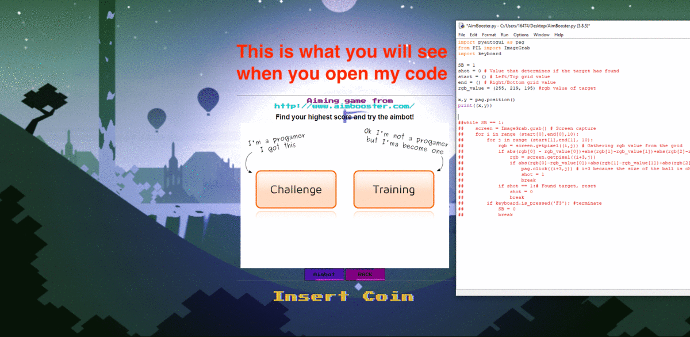

# Aimbot

Simple Aimbot developed using Python.

This aimbot can play the aim game from http://www.aimbooster.com/ 24/7 without any mistake.

Once you download my code, import the followings if you don't have it in your computer

For PC                                For Mac
1. pip install pyautogui              python3 -m pip3 install pyautogui
2. pip install keyboard               pip3 install keyboard

Then change 'start' and 'end' value depending on your screen size.
You can simply obtain these values by running

x,y = pag.position()
print((x,y))

while commenting out the entire 'while' function

The game does not end until you make a mistake 3 times. However, my Aimbot will not make any mistakes, therefore the game will run forever.
To stop the Aimbot, press F3. :)

☆ ★ ☆ ★ ☆ ★ ☆ ★ ☆ ★ ☆ ★ ☆ ★ ☆ The result ☆ ★ ☆ ★ ☆ ★ ☆ ★ ☆ ★ ☆ ★ ☆ ★ ☆ 

